  <picture>
    <source media="(prefers-color-scheme: dark)" srcset="assets/banner.svg">
    <source media="(prefers-color-scheme: light)" srcset="assets/banner.svg">
    
  </picture>

 

  <table>
    <tr>
      <td align="center" width="50%">
        <b>SYS.LOCATION</b> 
        <code>[ Lahore, Pakistan ]</code>
      </td>
      <td align="center" width="50%">
        <b>SYS.STATUS</b> 
        <code>[ Available for Opportunities ]</code>
      </td>
    </tr>
  </table>

### ⧉ ARCHITECTURE & DEPLOYMENTS

<table>
  <tr>
    <td width="50%">
      
    </td>
    <td width="50%">
      
    </td>
  </tr>
</table>

### ⚙️ CORE STACK

  

### 🛰️ TELEMETRY

  
  

 

  <picture>
    <source media="(prefers-color-scheme: dark)" srcset="https://raw.githubusercontent.com/ibrahimshkeel1/ibrahimshkeel1/output/github-contribution-grid-snake-dark.svg">
    <source media="(prefers-color-scheme: light)" srcset="https://raw.githubusercontent.com/ibrahimshkeel1/ibrahimshkeel1/output/github-contribution-grid-snake.svg">
    
  </picture>

---

  
  

