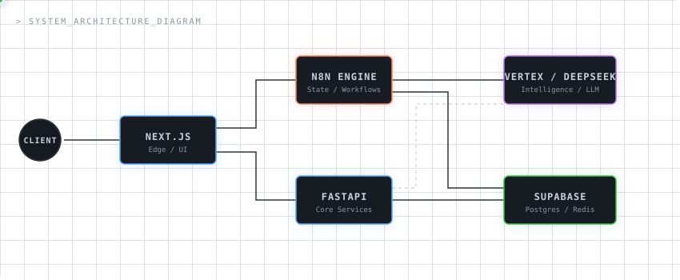

  <picture>
    <source media="(prefers-color-scheme: dark)" srcset="assets/portfolio-hero.svg">
    <source media="(prefers-color-scheme: light)" srcset="assets/portfolio-hero.svg">
    
  </picture>

### ⧉ CORE STACK

  

  
  
  

### ⧉ ARCHITECTURE BLUEPRINT

  <picture>
    <source media="(prefers-color-scheme: dark)" srcset="assets/architecture.svg">
    <source media="(prefers-color-scheme: light)" srcset="assets/architecture.svg">
    
  </picture>

---

  
  
  

